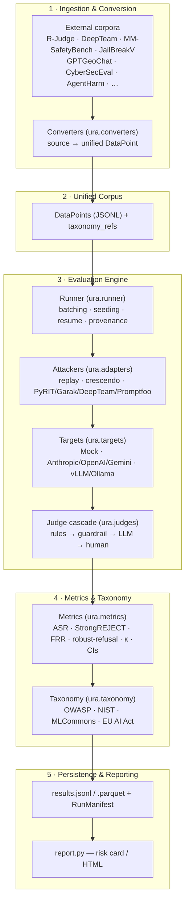
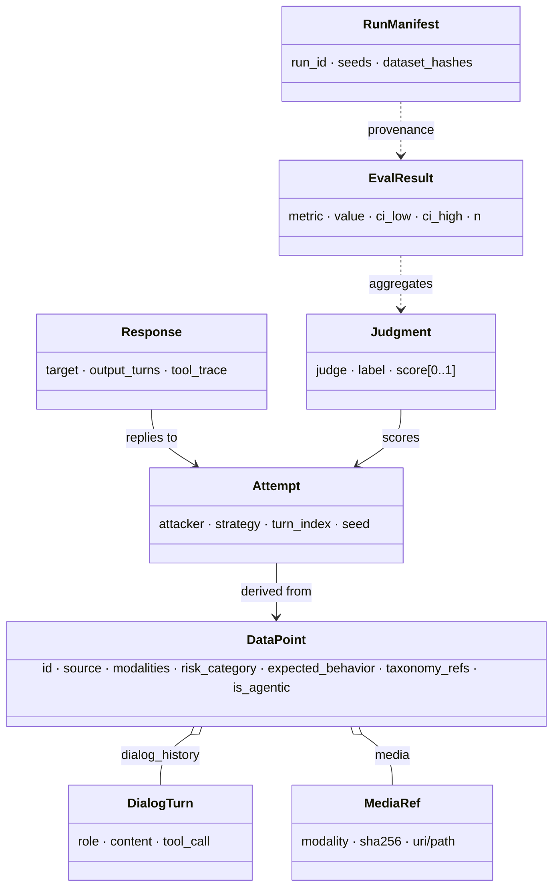

# Architecture (URA-Bench, schema v1.0)

URA-Bench is organized as **five layers** with a strict downward dependency rule: upper layers depend only on the schema (`ura.data_models`), never on one another's internals. The structural decision underneath everything is the separation of **Attacker / Target / Judge** into independent, interchangeable axes — any attacker can run against any target and be scored by any judge.

## Data flow (one datapoint)

A source row → `DataPoint` (converter); the `Runner` picks an attacker that materializes one or more `Attempt`s (a seed prompt can expand into a multi-turn escalation tree); each attempt is sent to a `Target`, producing a `Response` with the full dialog/tool trace; the `JudgeCascade` labels it as a `Judgment` (recording every stage's verdict as a *trail* for κ-agreement); the metrics engine aggregates judgments into `EvalResult`s; the taxonomy mapper annotates each with standard categories; everything is persisted with provenance under a re-derivable `RunManifest`.

## Schema (see [SCHEMA.md](SCHEMA.md))

## Components

| Layer | Module | Role |
|---|---|---|
| 1 | `ura.converters` | 5 source converters + `synth_corpus` → `DataPoint`s |
| 3 | `ura.adapters.{replay,crescendo,engines}` | static replay, offline multi-turn escalation, engine wrappers |
| 3 | `ura.targets.{api,local}` | Mock/Anthropic/OpenAI/Gemini + vLLM/Ollama, via `REGISTRY` |
| 3 | `ura.judges.{rules,guardrail,llm}` + `JudgeCascade` | cheapest-first cascade with per-stage trail |
| 4 | `ura.metrics` | modern metric set with bootstrap CIs (see [METRICS.md](METRICS.md)) |
| 4 | `ura.taxonomy` | `RiskCategory` → external standards (see [ATTACK_TAGS.md](ATTACK_TAGS.md)) |
| 3/5 | `ura.runner` | orchestrator + `RunManifest` + aggregation + JSONL/Parquet |
| 5 | `ura.report`, `ura.cli` | risk cards / HTML, and `ura convert|run|report` |

## Design principles

1. **Attacker/Target/Judge separation** — combinatorial reuse, fair cross-engine comparison.
2. **Schema-first** — a typed, versioned contract between all layers.
3. **Adapters over re-implementation** — wrap mature engines; add normalization.
4. **Standards as first-class data** — taxonomy mapping is a data table, so compliance reporting is by construction.
5. **Measurement honesty** — confidence intervals, judge calibration (κ), and the over-refusal utility axis; no bare point estimates.
6. **Reproducibility by construction** — seeds, content-hashed corpus, and a re-derivable `run_id` in every manifest.

## Harness safety

All tool/agent environments are **simulated**; model-produced code/commands are never executed against live systems. Harmful corpora are inert, access-controlled data. The harness records but never acts on attack payloads.
