# Architecture

URA-Bench separates corpus meaning, attack generation, model execution,
judgment, and analysis. The shared boundary is schema 1.2 in
`ura.data_models`; targets do not define success, and judges do not generate
attacks.

```mermaid
flowchart LR
    S[Verified local release] --> P[Content-bound pilot/main partition]
    P --> C[Strict converter / DataPoint]
    C --> A[Replay or stateful attacker]
    A --> T[Hosted or local target]
    T --> J[Full-shadow judge cascade]
    J --> R[Runner 2.2 artifacts]
    R --> D[Disjoint pilot + frozen confirmatory plan]
    D --> H[Main analysis + human audit]
    H --> F[Final artifact and measured figures]
```

External engines may instead run natively and be imported as
`NativeEngineRun`. Their upstream target/judge and estimand remain explicit;
they are not silently pooled into common URA ASR/FRR.

## Components

| Layer | Modules | Responsibility |
| --- | --- | --- |
| Schema/taxonomy | `data_models.py`, `taxonomy.py` | typed records and informational standards mapping |
| Ingestion | `converters/` | strict release parsing, source-policy identity, media confinement/hashing |
| Attacks | `adapters/` | static replay, response-conditioned Crescendo, bounded external bridges |
| Targets | `targets/` | mock, hosted API, vLLM, and Ollama transports with declared capabilities |
| Judgment | `judges/` | rules, guard classifier, LLM grader, complete shadow trail |
| Runtime | `runner.py`, `experiments/run_matrix.py` | validation, durable ceilings, locks, circuits, exact resume, manifests |
| Measurement | `metrics.py`, `source_metrics.py` | population-aware common/source metrics, clustered and survival estimates |
| Analysis | `experiments/` | partition, pilot, frozen confirmatory families, human audit, figures |

## Execution and recovery

A static attacker produces complete rendered attempts. A stateful attacker opens
a bounded session: Runner submits one turn, returns the actual response to the
session, and only then requests the next. `max_queries` and `max_turns` are hard
per-datapoint bounds; a harmful violation ends the trajectory immediately.

Before external calls, the matrix persists reservations against durable
matrix-wide target-call, judge-call, transport-attempt, and deadline ceilings.
Grid and cell locks prevent concurrent reuse of one artifact namespace. A
systemic provider/judge failure opens a durable circuit so sibling cells do not
repeat it; `--reset-open-circuits` is an explicit operator acknowledgement after
the cause is fixed. Append-only checkpoints resume verified completed attempts,
including provider continuation state, without repeating them. These are call-
exposure controls, not dollar, token, or provider-billing guarantees.

Run identity binds corpus/configuration/source code; provider-resolved identity
is reconstructed separately from responses and trails. Any conflicting non-null
provider/model/fingerprint/revision/digest fails the cell, including across
resume. Completion is atomic and validated before postprocessing.

## Release, partition, and provider gates

Every real non-synthetic scored run must use the SHA-256-bound
`ura-cluster-partition/1.1` artifact and select exactly `pilot` or `main`. The
partition is exhaustive and disjoint over source prompt/intent clusters and
binds the full converted-corpus digest and population. MM-SafetyBench and
MOSSBench additionally enforce their maintained pinned release counts and
manifest/table hashes. Measured execution uses `--limit 0`; ad hoc cluster caps
are diagnostics, not a substitute for the frozen partition.

Every hosted target and hosted LLM judge must also appear exactly once in a
SHA-256-bound provider data-policy approval, including its role and accepted
retention/data-use terms. The normalized approval and artifact digest enter the
grid and every cell.

## Modality behavior

Coverage is planned from actual adapter capabilities and available converted
data. The pre-call plan requires text and each explicitly implemented physical
combination; the post-run result requires at least one real eligible execution
for each planned combination. It never infers arbitrary media cross-products or
treats a blocked input as execution evidence.

The canonical Fable and Sol adapters currently support text and text+image.
StrongREJECT supplies text; MM-SafetyBench and MOSSBench supply text+image.
Audio and video remain explicit unavailable combinations until a target adapter
implements and declares them. Media is never dropped, captioned, or coerced to
text inside the registered run.

## Safety and scope

Core tool traces are inert. External subprocess filtering reduces accidental
secret leakage but is not a sandbox; untrusted engines need a disposable,
least-privilege environment with bounded filesystem, network, processes, and
resources. Provider-bound content leaves the machine and is subject to the
content-addressed approval described in [SECURITY.md](../SECURITY.md).

Taxonomy crosswalks are navigation aids, not certification or legal conformity
claims. Experiments remain pending until complete real artifacts pass every
gate above.
