# Architecture

```mermaid
flowchart LR
    S[Verified corpus releases] --> C[Converters]
    C --> U[Unified schema]
    U --> P[Release, policy, metric and modality preflight]
    P --> A[Replay or response-conditioned attacker]
    A --> T[Hosted, local or guarded target]
    T --> J[Rule, guardrail and LLM judge cascade]
    J --> R[Artifacts, checkpoints, budgets and completion]
    R --> D[Diagnostics and automated-label-blinded,<br/>model-visible human audit]
    D --> X[Post-experiment analysis and figures]
```

Experiments are pending. This architecture describes implemented control flow,
not model performance or judge validity.

## Boundaries

| Layer | Location | Responsibility |
| --- | --- | --- |
| Data | `src/ura/data_models.py`, `src/ura/converters/` | typed records, source identity, media and policy provenance |
| Attacks | `src/ura/adapters/` | replay, transforms, response-conditioned escalation, native-result bridges |
| Targets | `src/ura/targets/` | exact hosted/local invocation and provider continuation state |
| Judgment | `src/ura/judges/` | ordered cascade, authoritative decision and full shadow trail |
| Runtime | `src/ura/runner.py`, `experiments/run_matrix.py` | preflight, execution, budgets, checkpoints, recovery and manifests |
| Analysis | `experiments/` | paired effects, transfer, judge sensitivity, human audit and figures |

## Direct operator flow

The complete run is intentionally linear:

1. clone and install the project;
2. download the exact StrongREJECT, MM-SafetyBench, and MOSSBench releases and
   bind local media roots;
3. set hosted credentials and review provider/data terms;
4. execute the intended arguments with `experiments.rig_check`;
5. run the all-corpus replay grid and the StrongREJECT-only Crescendo grid with
   finite target, judge, transport-attempt, and time ceilings;
6. preserve all artifacts and ordinary provenance; and
7. perform diagnostics, the automated-label-blinded/model-visible human audit, post-experiment analysis, and
   measured rendering.

## Schema and source boundaries

Converters preserve source item identifiers, policies, expected behavior,
modalities, cluster identity, and source-specific metric metadata. A unified
record does not imply a unified estimand. Common ASR/FRR admission requires a
substantive implemented evaluator for the exact source/metric pair; conversion
alone is insufficient.

StrongREJECT, MM-SafetyBench, and MOSSBench enforce their pinned official release
contracts before target calls. Real corpora resolve through environment paths.
Local media is digest-checked beneath ordered approved roots and persisted as
`@media-root/<index>/<relative-path>` so artifacts do not retain an author's
absolute path.

## Multimodal admission

For each grid, the planner intersects that grid's selected-corpus modality
combinations with each target's declared capabilities. It requires those
selected supported combinations, not an invented Cartesian product. Post-run validation
requires real eligible Attempt--Response evidence for each delivered
combination. Tags without byte-backed delivery, setup-only turns, and input-side
defense blocks do not count.

The named Fable and Sol targets currently declare text and image. The main
corpus set therefore exercises text and text+image on both. Audio and video are
reported unavailable.

## Target and judge identity

Hosted and local targets implement one message-level contract but retain
provider-specific authentication, sampling controls, media encoding, refusal
semantics, and continuation state. The runtime records requested and realized
target identities and rejects non-null identity drift within a cell or across
resume.

The judge cascade retains every queried stage's label, score, confidence, parse
status, rationale, role, and exact response binding. The first
confidence-clearing stage is authoritative; later stages are shadows. Crescendo
setup turns are typed `not_applicable`, query no judge, and enter no metric.
Judge sensitivity and human validation reuse stored artifacts and make no target
calls.

## Durability and paid-call containment

The grid declares finite matrix-wide target-call, model-judge-call,
HTTP-attempt, and call-start deadline ceilings. Reservations, response
checkpoints, completed-attempt checkpoints, circuits, errors, and completion
markers are durable. Before another external call, recovery validates the
same-grid budget high-water mark and exact run/component lineage. Malformed,
oversized, symlinked, partial, or mismatched recovery artifacts fail closed.

Grid and cell locks are created exclusively and are never reclaimed
automatically. A human may remove only an exact abandoned lock after verifying
that no owner is active and recording the intervention. Infrastructure errors
remain errors and never become safe responses.

## Artifact boundary

An admitted cell persists attempts, responses, authoritative judgments,
full-shadow trails, aggregate results, manifest, checkpoint, and completion
marker. A failed cell persists a typed error artifact. A complete matching
marker makes rerun call-free; a matching checkpoint resumes without repeating
completed attempts.

Postprocessing accepts only coherent completion-validated cohorts. It preserves
benchmark, source policy, modality, model, defense, attacker, judge, cluster,
seed, turn, and code/schema identity. Partial or mixed artifact families are not
silently aggregated.

## Native-engine boundary

Native external engines are imported at their complete result-artifact boundary
when their attack, target, and evaluator jointly define the source result.
Replaying only a generated prompt through URA would change the estimand. Such
imports retain source-native rates and are common-metric-ineligible unless a
separate explicitly matched design supports comparison.

Third-party engine subprocesses are not security sandboxes. Execute untrusted
engines in an isolated container, VM, or low-privilege account with minimal
mounts, explicit network and credential policy, process-tree termination, and
resource quotas.
