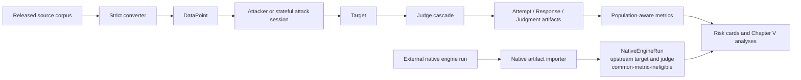

# Architecture

URA-Bench separates corpus semantics, attack generation, model execution, and
judgment. The shared boundary is the typed schema in `ura.data_models`; a target
does not decide what counts as success, and a judge does not generate attacks.

There are two execution paths. Most work follows the common Runner path, where
URA generates attempts, calls a target, and applies its own judge cascade. Some
external engines instead run natively against their own target and judge, and URA
imports their completed artifacts without re-deciding success; such native runs
preserve the upstream estimand and are marked common-metric-ineligible, so they
are never pooled into URA's own ASR/FRR.

## Components

| Layer | Modules | Responsibility |
| --- | --- | --- |
| Schema and taxonomy | `data_models.py`, `taxonomy.py` | typed records and informational standards crosswalk |
| Ingestion | `converters/` | source-specific parsing, semantic mapping, media confinement and hashing |
| Attacks | `adapters/` | static replay, response-conditioned Crescendo, and isolated external-engine bridges |
| Targets | `targets/` | mock, hosted APIs, and local vLLM/Ollama gateways |
| Judgment | `judges/` | deterministic rules, guard classifier, LLM grader, full shadow trail |
| Orchestration | `runner.py` | validation, budgets, seeding, resume, lineage, manifests, persistence |
| Measurement | `metrics.py` | harmful/benign estimands, clustered uncertainty, survival and agreement |
| Reporting | `report.py`, `experiments/` | risk cards, figures, transfer, κ, and human calibration |

## Execution paths

Static attackers produce one or more complete rendered attempts. A stateful
attacker instead opens a session: Runner submits one turn, returns the actual
target response to the session, and only then requests the next turn. Both
`max_queries` and `max_turns` are hard caps. This distinction is material:
response-conditioned conversations are target-specific and are excluded from
cross-model transfer unless replayed verbatim.

For every target call, Runner persists the exact attempt and response, runs all
automated judge stages for a shadow trail, and marks the first confident stage
as authoritative. Human adjudication is an out-of-band calibration process, not
an automatic hidden fourth stage.

## Reproducibility

Run identity hashes the corpus, budget, seeds, target/attacker/judge
configuration, harness source tree, and relevant environment. Wall-clock time
is recorded but is not part of the identity. Provider-resolved values that do
not exist before a call are kept in a separate realized target/ordered-judge
identity inventory. Conflicting non-null model, provider, fingerprint, revision,
or digest values fail the cell, including across restored and new attempts.
Checkpoints are append-only; resume validates run IDs, attempt lineage,
rendered-input fingerprints, and this realized identity invariant before
reusing a response.

Requested seeds are passed only through target interfaces that advertise them.
The response records the effective sampling control reported by the target.
Hosted providers without a supported seed remain explicitly `uncontrolled`;
accepting a seed argument is not treated as proof of determinism.

## Modality behavior

A datapoint records declared modality and target-supported modality separately.
Unsupported required channels must not be presented as an equivalent multimodal
observation. Effective-modality metadata is retained for diagnostics, while the
experiment protocol excludes unsupported cells from modality-specific
estimands.

Local media is a trust boundary. Converters may resolve only under their corpus
root; target encoders may read only under configured approved roots, must verify
SHA-256, and enforce URI/MIME/size restrictions before sending content to a
provider.

## Safety and scope

Core records and converted tool traces are inert. URA-Bench does not execute
model-produced commands or assert that represented tool effects occurred.
External red-team engines are optional subprocess/dependency integrations. The
environment filter is only accidental secret-leak reduction, not a sandbox; run
untrusted engines in a disposable container/VM or low-privilege account with an
isolated HOME, minimal mounts, network policy, process-tree termination, and
resource/output quotas. Forward only explicit credentials.
Provider-bound prompts and media leave the local machine, so the operator must
apply the provider-data and dataset-license rules documented in `SECURITY.md`.

The OWASP, NIST, MLCommons, and EU AI Act entries are navigation aids. They do
not make a benchmark run a certification, conformity assessment, or legal
compliance decision.
