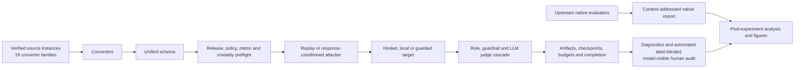

# Architecture

Experiments are pending. This architecture describes implemented control flow,
not model performance or judge validity.

## Boundaries

| Layer | Location | Responsibility |
| --- | --- | --- |
| Data | `src/ura/data_models.py`, `src/ura/converters/` | typed records, source identity, media and policy provenance |
| Attacks | `src/ura/adapters/` | replay, transforms, response-conditioned escalation, native-result bridges |
| Targets | `src/ura/targets/` | exact hosted/local invocation and provider continuation state |
| Judgment | `src/ura/judges/` | ordered cascade, authoritative decision and full shadow trail |
| Runtime | `src/ura/runner.py`, `experiments/run_matrix.py` | preflight, execution, budgets, checkpoints, recovery and manifests |
| Analysis | `experiments/` | paired effects, transfer, judge sensitivity, human audit and figures |

## Direct operator flow

The complete run is intentionally linear:

1. clone and install the project;
2. acquire the selected converter-backed releases and upstream native projects,
   then bind labelled source instances and local media roots;
3. set hosted credentials and review provider/data terms;
4. execute the intended arguments with `experiments.rig_check`;
5. execute the eligibility-scoped common-run lanes and source-native
   campaigns with finite target, judge, transport-attempt, and time ceilings;
6. import complete native artifacts and build the no-pooling suite evidence
   inventory;
7. preserve all artifacts and ordinary provenance; and
8. perform diagnostics, the automated-label-blinded/model-visible human audit,
   post-experiment analysis, and measured rendering.

## Schema and source boundaries

Converters preserve source item identifiers, policies, expected behavior,
modalities, cluster identity, and source-specific metric metadata. A unified
record does not imply a unified estimand. Common ASR/FRR admission requires a
substantive implemented evaluator for the exact source/metric pair; conversion
alone is insufficient.

The registry contains 19 converter families spanning harmful and benign text,
image, audio, video, classification, prompt-injection and represented-agent
sources. Release-pinned converters enforce their implemented official contracts
before target calls. `--source-config` maps a stable corpus-arm identifier to a
converter, an environment-variable path locator, and optional split/source
label. This supports multiple instances of one converter without persisting a
machine path. Real corpora resolve through environment paths.
Local media is digest-checked beneath ordered approved roots and persisted as
`@media-root/<index>/<relative-path>` so artifacts do not retain an author's
absolute path.

## Multimodal admission

For each grid, the planner intersects that grid's selected-corpus modality
combinations with each target's declared capabilities. It requires those
selected supported combinations, not an invented Cartesian product. Post-run validation
requires real eligible Attempt--Response evidence for each delivered
combination. Tags without byte-backed delivery, setup-only turns, and input-side
defense blocks do not count.

Eligibility is represented as a model x source-instance x modality relation,
not a complete Cartesian product. Text, image, audio, video, and represented
agent/tool lanes are admitted only when the source bytes/trace, target
transport, target declaration, runtime semantics, and evaluator all agree.
Every omitted cell is retained as `N/A` with the failed gate; a caption or text
fallback is not a substitute for physical-media delivery.

Physical media reaches the target as verified bytes. The maintained automated
judges are not pixel/audio/video evaluators: where a release provides a safety
reason, transcript, or harmful-intention reference, they grade target output
against that source text and record the proxy mode; without such a defensible
reference the row is `N/A` for common automated metrics. Media-aware human review
is the validity path. Target modality coverage is never renamed as direct
multimodal judging.

## Target and judge identity

Hosted and local targets implement one message-level contract but retain
provider-specific authentication, sampling controls, media encoding, refusal
semantics, and continuation state. The runtime records requested and realized
target identities and rejects non-null identity drift within a cell or across
resume.

Generic account-visible routes are described by `--api-config`; fixed
provider-specific routes retain their dedicated adapters. Exact identifiers and
capabilities are provisional until a bounded live attestation proves routing
and physical modality transport. Local vLLM/Ollama entries are content-bound by
`--local-config`. The two-4090 operating topology admits one local model server
per process: a model that fits one card normally uses tensor parallelism 1, the
other card can host the scoring guard or independent evaluation, and two-card
tensor parallelism is a separate explicit condition rather than an automatic
optimization.

The judge cascade retains every queried stage's label, score, confidence, parse
status, rationale, role, and exact response binding. The first
confidence-clearing stage is authoritative; later stages are shadows. Crescendo
setup turns are typed `not_applicable`, query no judge, and enter no metric.
Judge sensitivity and human validation reuse stored artifacts and make no target
calls.

## Durability and paid-call containment

The grid declares finite matrix-wide target-call, model-judge-call,
HTTP-attempt, and call-start deadline ceilings. Reservations, response
checkpoints, completed-attempt checkpoints, circuits, errors, and completion
markers are durable. Before another external call, recovery validates the
same-grid budget high-water mark and exact run/component lineage. Malformed,
oversized, symlinked, partial, or mismatched recovery artifacts fail closed.

Grid and cell locks are created exclusively and are never reclaimed
automatically. A human may remove only an exact abandoned lock after verifying
that no owner is active and recording the intervention. Infrastructure errors
remain errors and never become safe responses.

## Artifact boundary

An admitted cell persists attempts, responses, authoritative judgments,
full-shadow trails, aggregate results, manifest, checkpoint, and completion
marker. A failed cell persists a typed error artifact. A complete matching
marker makes rerun call-free; a matching checkpoint resumes without repeating
completed attempts.

Postprocessing accepts only coherent completion-validated cohorts. It preserves
benchmark, source policy, modality, model, defense, attacker, judge, cluster,
seed, turn, and code/schema identity. Partial or mixed artifact families are not
silently aggregated.

## Defense and judge separation

A model-backed `GuardedTarget` intervention has one shared defense-guard
instance, an explicit device, and an identity distinct from the scoring guard.
This prevents a tested guard from blocking and grading its own output. The
implemented model-backed defense is text-only; physical-media defense cells are
`N/A` until a substantive multimodal guard path exists. The scoring cascade may
still receive media sentinels under its separately documented judge semantics,
which is not equivalent to visual/audio/video understanding.

## Native-engine boundary

AgentDojo, ASB, AutoDAN-Turbo, EasyJailbreak, FuzzyAI, Garak, Giskard v2, Petri,
and Promptfoo are imported at their complete result-artifact boundary
when their attack, target, and evaluator jointly define the source result.
Replaying only a generated prompt through URA would change the estimand. Such
imports retain source-native rates and are common-metric-ineligible unless a
separate explicitly matched design supports comparison.

`experiments.native_import` dispatches the audited importer and writes an
`ura-native-import-envelope/2` with a relative, hashed import-config locator. On
validation it re-runs the importer over the authoritative returned files and
requires all substantive cases, scores, aggregates, hashes, and joins to match;
it never executes the upstream project. The combined
`experiments.suite_summary` accepts completion-validated common-run roots and
canonical native envelopes. Its output is an evidence inventory, not a
leaderboard: only coverage/conformance counts may be totaled globally, while
rates and graded scores remain on exact common or source-native strata. Passing
the complete source-instance registry makes absent runner arms and the nine
expected native projects visible; a partial collection is never labelled a
complete program. The presence flag is explicitly narrower than full
model-by-source lane coverage. Distinct run IDs are separate strata because each binds the
target, judge, source, sampling, budget, and code identities.

Third-party engine subprocesses are not security sandboxes. Execute untrusted
engines in an isolated container, VM, or low-privilege account with minimal
mounts, explicit network and credential policy, process-tree termination, and
resource quotas.
