# Architecture

```mermaid
flowchart LR
    O[Operator-selected targets,<br/>logical arms and attackers] --> E[Content-addressed<br/>request envelope]
    E --> S[Verified source instances<br/>19 converter families]
    S --> C[Converters]
    C --> U[Unified schema]
    U --> P[Release, policy, metric and modality preflight]
    P --> Q[Content-addressed no-call lane projection]
    Q --> L[Typed live route/transport receipt gate]
    L --> A[Replay or response-conditioned attacker]
    A --> T[Hosted, local or guarded target]
    T --> J[Rule, guardrail and LLM judge cascade]
    J --> R[Artifacts, checkpoints, budgets and completion]
    N[Upstream native evaluators] --> I[Content-addressed native import]
    R --> D[Diagnostics, exact analysis selection and<br/>automated-label-blinded human audit]
    I --> X
    D --> X[Post-experiment analysis and figures]
```

Experiments are pending. This architecture describes implemented control flow,
not model performance or judge validity.

## Boundaries

| Layer | Location | Responsibility |
| --- | --- | --- |
| Data | `src/ura/data_models.py`, `src/ura/converters/` | typed records, source identity, media and policy provenance |
| Attacks | `src/ura/adapters/` | replay, transforms, response-conditioned escalation, native-result bridges |
| Targets | `src/ura/targets/` | exact hosted/local invocation and provider continuation state |
| Judgment | `src/ura/judges/`, `src/ura/source_metrics.py` | ordered full-shadow cascade for common responses; source evaluator and unqueried placeholders for source-metric-only records |
| Runtime | `src/ura/runner.py`, `src/ura/request_envelope.py`, `src/ura/project_revision.py`, `src/ura/live_attestation.py`, `src/ura/lane_projection.py`, `src/ura/lane_canary.py`, `experiments/run_matrix.py`, `experiments/project_revision.py`, `experiments/live_attestation.py`, `experiments/lane_canary.py` | prospective whole-arm request identity, bound early failures, immutable local-project admission, preflight, no-call projection, typed route/transport receipt production and admission, diagnostic canary summary, execution, budgets, checkpoints, recovery and manifests |
| Analysis | `experiments/level1_evidence.py`, other `experiments/` modules | unit-qualified lifecycle accounting, paired effects, transfer, judge sensitivity, human audit and figures |

## Direct operator flow

The complete run is intentionally linear:

1. select and detach at one prospectively reviewed full project commit, create
   and digest a `ura-project-revision/1` receipt from the clean checkout, export
   its path/hash, install the project, and retain that identity for the cohort;
2. acquire the selected converter-backed releases and upstream native projects,
   then bind labelled source instances and local media roots;
3. set hosted credentials and review provider/data terms;
4. execute the intended arguments with `experiments.rig_check`, retain the
   prospective lane projection, and obtain operator approval for complete-grid
   caps and provider-side quota;
5. prepare any selected T3MP3ST or HarmBench attacker artifact under its own
   cap, outside the Runner, then bind the exact output hash to the measured
   attacker config;
6. run bounded live target/modality probes, derive and hash their typed receipts,
   and bind the same operator-declared execution scope to each measured grid;
7. execute a separately typed one-cluster diagnostic canary where required,
   then execute the eligibility-scoped common-run lanes and source-native
   campaigns with finite target, judge, transport-attempt, and time ceilings;
8. import complete native artifacts and build the no-pooling suite evidence
   inventory;
9. preserve all artifacts and ordinary provenance; and
10. perform diagnostics, the automated-label-blinded/model-visible human audit,
   post-experiment analysis, and measured rendering.

Every non-dry preflight, transport probe, diagnostic canary, and measured Runner
request consumes that same digest-approved receipt. It verifies local expected
and observed commit equality, HEAD tree, common driver/imported-harness Git root,
clean tracked state, and current driver/harness source digests. Its compact
binding travels through eligibility, grid, `RunManifest.config.run`, completion,
live-attestation, and postprocessing identities. A revision change is a
prospective protocol amendment and new cohort, not a resumable old run. A fully
synthetic dry-run is the sole explicit exemption and records
`mode=not_required_diagnostic_dry_run` together with actual source digests.
Neither mode authenticates a remote repository or proves empirical validity.

## Schema and source boundaries

Converters preserve source item identifiers, policies, expected behavior,
modalities, cluster identity, and source-specific metric metadata. A unified
record does not imply a unified estimand. Common ASR/FRR admission requires a
substantive implemented evaluator for the exact source/metric pair; conversion
alone is insufficient.

The registry contains 19 converter families spanning harmful and benign text,
image, audio, video, classification, prompt-injection and represented-agent
sources. Release-pinned converters enforce their implemented official contracts
before target calls. `--source-config` maps a stable corpus-arm identifier to a
converter, an environment-variable path locator, and optional split/source
label. This supports multiple instances of one converter without persisting a
machine path. Real corpora resolve through environment paths.
For one unchanged converted-corpus digest and `sample_seed`, bounded real-source
cluster selection uses a deterministic shuffled ordering and nested prefixes;
`--limit 1` is therefore contained in a later `--limit N` selection. Every row
belonging to a selected cluster is retained.
Local media is digest-checked beneath ordered approved roots and persisted as
`@media-root/<index>/<relative-path>` so artifacts do not retain an author's
absolute path.

The registry is configuration provenance, not acquisition evidence. Every
selected non-synthetic measured run and every no-call `rig_check` preflight also
consumes one exact, compact
`ura-source-conformance/1` receipt. Before target construction the driver
rehashes its declared source files and derives the converted-corpus, cluster,
policy, metric-mode, and media evidence already needed by the runtime. A
selected arm that is not operator-admitted with an observed revision,
approved access/license review, reconciled source counts, and a passed bounded
semantic mapping check fails closed. These checks validate the supplied receipt
and current conversion only; they do not establish upstream authenticity, automate
a legal determination, or establish benchmark/evaluator validity.
A real-source `run_matrix --dry-run` can inspect conversion without a receipt,
but that diagnostic is not admitted preflight or experiment evidence.

## Multimodal admission

For each grid, the planner intersects that grid's selected-corpus modality
combinations with each target's declared capabilities. It requires those
selected supported combinations, not an invented Cartesian product. Post-run validation
requires real eligible Attempt-Response evidence for each delivered
combination. Tags without byte-backed delivery, setup-only turns, and input-side
defense blocks do not count.

Eligibility is represented as a requested-target x selected-source-stratum x
exact-modality x attacker relation, not an invented complete Cartesian product.
After the selected corpora materialize, `run_matrix` writes a content-addressed
`ura-eligibility-plan/1` artifact before any model call. It retains every
requested planning stratum as `compatible_if_isolated` or `N/A`, with its failed
gates, whole-arm execution-unit status, and bound configuration/corpus digests.
This is planning evidence only: it is not a live
attestation, attempted/completed-cell record, or scientific result.

At the earlier boundary, after basic argument/axis validation but before config
or source materialization, `run_matrix` writes `ura-request-envelope/1`. Its
units are exactly requested target x logical source arm x attacker. A bound
`ura-request-error/1` may then record a configuration, source-integrity,
conversion, empty-corpus, or diagnostic-admission failure at whole-request,
target, arm, or exact-request-unit scope. Such an error states that execution and
provider calls did not start. It never reconstructs source-policy/modality
strata or claims attempted execution. Argument parsing and basic request-shape
rejections before this boundary are not retroactively represented. The envelope
is the operator-selection universe, not normalized config/receipt identity;
config-only variants sharing it belong in separate Level-1 cohorts.

After the whole request passes admission and before the first generation call,
Runner 2.15 writes a content-addressed `ura-lane-projection/1`. The artifact
binds the exact experiment condition and eligibility descriptor, selected
record/cluster/source-policy counts, deterministic sampling identities,
selected physical input-media bytes, and the conservative complete-grid target,
model-judge, local-guardrail, and declared HTTP-attempt exposure. A measured
grid binds its exact projection descriptor; `rig_check` validates and copies the
same artifact class into the separate preflight tree. Input bytes are observed
from selected local media, not an expected-output estimate. Token use,
price/cost, runtime/throughput, and expected output storage remain
`CANNOT-VERIFY` until independently observed and are never extrapolated by the
projection.

The read-only `experiments.level1_evidence` boundary automatically discovers
request envelopes from supplied result roots and eligibility siblings, then
joins any final plan in one selected `run_matrix` cohort, including plan-only
structural-`N/A` or blocked requests, to complete or partial grids under the
same content-derived condition. Its `ura-level1-evidence/2` output retains four non-interchangeable units:
prospective whole-arm request units, materialized planning strata, whole-arm
execution units, and completed Judgment records. Prospective units stay in the
JSON and are not planning rows. Whole-arm execution is projected onto a
planning stratum only after the completed artifacts cover that stratum's exact
selected-datapoint count and identity digest. Grid, completion, and error
evidence remains bound through locator/SHA-256/byte descriptors; a mismatched
embedded plan or artifact descriptor fails closed. The cohort's
`evidence_kind` is either `diagnostic_dry_run` or `measured_run`, and those modes
cannot be mixed in one artifact. For measured grids, the current boundary also
consumes each grid-bound `ura-live-attestation/2` artifact by exact byte digest,
reconstructs its route/config/scope/age and exact-modality prerequisite, checks
the completed cell's stable realized identity, and reports matched record-level
attestation support. Probe grids are diagnostic and cannot enter a measured
Level-1 cohort. Analysis inclusion remains `not_supplied` with null counts; the
system does not infer it from a folder or post-hoc output. Pre-materialization failures are
bound to prospective request units only; the join never fabricates
source/modality rows or calls for them. It identifies
diagnostic dry-run input but explicitly sets empirical validity to false.
No-call `rig_check` plans and live transport-probe artifacts remain in separate
preflight/attestation trees and are not supplied as measured Level-1 requests.

Physical media reaches the target as verified bytes. The maintained automated
judges are not pixel/audio/video evaluators: where a release provides a safety
reason, transcript, or harmful-intention reference, they grade target output
against that source text and record the proxy mode. Without such a defensible
reference, a media-conditioned row is `N/A` for common automated metrics. A
separately typed `response_only` endpoint may grade literal response behavior
without a reference, but cannot support a claim about media understanding.
Media-aware human review is the validity path. Target modality coverage is never
renamed as direct multimodal judging.

## Target and judge identity

Hosted and local targets implement one message-level contract but retain
provider-specific authentication, sampling controls, media encoding, refusal
semantics, and continuation state. The runtime records requested and realized
target identities and rejects non-null identity drift within a cell or across
resume.

Generic account-visible routes are described by `--api-config`; fixed
provider-specific routes retain their dedicated adapters. Exact identifiers and
capabilities are provisional until a bounded non-dry probe yields a strict
`ura-live-attestation/2` receipt. The receipt binds its producer grid/completion
digests, operator-declared non-secret execution scope, requested and base-resolved
target, hosted/local route kind, secret-free route-config digest, exact delivered
combination, UTC observation, harness/driver source digests, and realized
identity. Ordinary non-dry grids fail
closed on a missing, stale, future-dated, ambiguous, or mismatched receipt before
target calls; a returned or restored response must also match the attested stable
provider/runtime identity. Exact combinations are not widened: text+image is not
evidence for text alone. `rig_check` and dry-run remain no-attestation paths.
The UTC observation is the probe Runner manifest's content-bound `started_at`,
used as a conservative lower bound instead of mutable outer-grid `finished_at`
metadata.
Local vLLM/Ollama entries are content-bound by
`--local-config`. The two-4090 operating topology admits one local model server
per process: a model that fits one card normally uses tensor parallelism 1, the
other card can host the scoring guard or independent evaluation, and a larger
profile-fit model may resolve to two-card tensor parallelism. Hardware auto
chooses the highest fitting precision: unquantized 16-bit, FP8 8-bit on SM 7.5+,
then BitsAndBytes 4-bit on SM 7.0+. The exact quantization and card count remain
a recorded execution condition; the estimate never substitutes for local-engine
preflight. Expert/MoE-ambiguous names stay parameter/fit-unknown until an exact
`parameter_count_b` is declared; their names never authorize a download or fit.

This receipt is deliberately not a cryptographic identity or account credential.
`execution_scope_id` is an operator assertion, so equivalence of accounts,
regions, projects, or runtime environments is CANNOT-VERIFY from the receipt.
It establishes only historical route/access and byte-backed delivery for the
recorded target/combination. It does not establish safety, source fidelity,
evaluator validity, benchmark validity, human validity, or future availability.
A synthetic live text or text+one-pixel-image probe needs no source receipt or
human rating and can exercise this transport boundary, but it remains diagnostic;
audio/video currently require prepared real-source media because no synthetic
audio/video fixture exists.

The judge cascade retains every queried stage's label, score, confidence, parse
status, rationale, role, and exact response binding. The first
confidence-clearing stage is authoritative; later stages are shadows. Crescendo
setup turns are typed `not_applicable`, query no judge, and enter no metric.
Judge sensitivity and human validation reuse stored artifacts and make no target
calls.

## Durability and paid-call containment

The grid declares finite matrix-wide target-call, model-judge-call,
HTTP-attempt, and call-start deadline ceilings. Reservations, response
checkpoints, completed-attempt checkpoints, circuits, errors, and completion
markers are durable. Before another external call, recovery validates the
same-grid budget high-water mark and exact run/component lineage. Malformed,
oversized, symlinked, partial, or mismatched recovery artifacts fail closed.

Every non-dry provider-backed invocation requires all logical-call and declared
HTTP-attempt ceilings to cover its complete conservative projection. This is a
fixed-universe admission rule: a smaller cap is rejected before provider calls,
not used to manufacture a paid partial result. The durable ledger records
conservative logical reservations and HTTP-attempt exposure; those values are
not realized network attempts. Provider-side project quota and an operator's
recorded cap approval remain external admission controls.

A `--diagnostic-canary` is a distinct execution purpose restricted to one
target, source arm, attacker, seed, and whole source cluster. The offline
`experiments.lane_canary` reader strictly validates the completed grid and emits
`ura-lane-canary/1`, labelled `synthetic_offline` for the mock synthetic path or
`live_diagnostic` for a live-attested path. It reports observed artifact bytes,
persisted timing observations, decision support, client-reported transport
attempts, and exercised/not-exercised roles separately from reserved exposure.
It permits no throughput, cost, storage, population, safety, or campaign
extrapolation. Default analysis admission rejects canaries from Level-1,
figures, suite summary, paired and transfer analyses, and human-audit
preparation. Native-project canaries execute under each upstream runtime and do
not enter this Runner summary.

Grid and cell locks are created exclusively and are never reclaimed
automatically. A human may remove only an exact abandoned lock after verifying
that no owner is active and recording the intervention. Infrastructure errors
remain errors and never become safe responses.

## Artifact boundary

The earliest durable success artifact is
`<envelope_id>.request-envelope.json`. A pre-materialization terminal failure is
`<error_id>.request.error.json` and is descriptor-bound to that envelope. A
later failure for the same envelope supersedes an earlier one; successful
eligibility removes the same-envelope stale error. Envelope descriptors are
bound under the exact key `request_envelope` in eligibility, grid, cell run, and
completion-validated manifest lineage.

An admitted cell persists attempts, responses, authoritative judgments,
full-shadow common trails or explicit source-metric-only placeholders, aggregate results, manifest, checkpoint, and completion
marker. A failed cell persists a typed error artifact. A complete matching
marker makes rerun call-free; a matching checkpoint resumes without repeating
completed attempts.

Postprocessing accepts only coherent completion-validated cohorts. It preserves
benchmark, source policy, modality, model, defense, attacker, judge, cluster,
seed, turn, and code/schema identity. Partial or mixed artifact families are not
silently aggregated.

## Console and operational state

The rig console (`experiments/rig_web.py`) is the approved campaign builder
over the maintained CLIs: a localhost-only, single-operator HTTP application
that launches every experiment as one allowlisted `python -m experiments.*`
argument vector (`shell=False`, typed parameters, interface-parity-tested
against the real module parsers). Its mode-aware builder enforces the
probe/canary/measured admission shapes before any subprocess exists and shows
the exact argument vector plus call ceilings for confirmation before a paid
mode starts. Jobs run in their own process group so a stop terminates the
complete child tree. The console's own operational actions (saving a
registry, reindexing, stopping a job, computing the recorded-usage cost
report) run in-process against the state database and retained artifacts
rather than as `experiments.*` commands; the reindex and usage report are
also exposed headlessly (`rig_web --reindex` / `--usage-report`).

At process startup the console snapshots platform, CPU model, physical/logical
cores and total RAM through `psutil`/platform fallbacks, and NVIDIA card/model,
VRAM, PCI, compute capability and driver data through `nvidia-smi`. The
dashboard and Build tab render that one snapshot. Build target filters compose
hosted provider selection (`All` initially) with local name substring, 10M-3T
maximum parameter count and a separate automatic 16/8/4-bit fit control
(initially on), plus a separate unchecked unknown-fit control. Known 16/8/4-bit
recommendations use green/blue/amber badges; unknown fit is neutral gray. The
per-model control names its precision. Compatible local
rows are selectable single-choice radios even when still unpinned; non-dry
server admission requires the exact revision/digest before launch. Unknown fit
is blocked under auto; an explicit per-model precision binds
`allow_unknown_fit: true` and permits only that operator-owned load attempt.
Known non-fit remains blocked. These are presentation controls only. Source arms
lacking an integrated evaluator also remain visible/selectable with a concise
badge and one custom hover/focus tooltip, while the
server rejects them before a subprocess; visibility never asserts runnability.
Dry composition discards real API/local selections because the runner uses
`MockTarget`, and local roster modality metadata is narrowed to its supported
text/image path so audio mismatches fail UI/CLI parity.

Console state persists in a stdlib-sqlite database (`console.db` under the
state directory): jobs with their exact argv and builder parameters, the
campaign-run registry, per-artifact recorded token usage, and a report
index; it carries a schema version, a startup integrity check, transactional
terminal-state commits, and a Reindex action that rebuilds every derived row
from retained artifacts with digest verification. This database is
operational state, never scientific evidence: usage rows are read only from
completion-marker-bound artifacts, cost is calculated only from the
operator-edited effective-dated pricing registry (missing data renders N/A,
never zero), and the validated filesystem artifacts remain the sole
measurement authority.

The pricing registry can be populated by hand or by the pricing fetcher
(`experiments/pricing_fetch.py`), which does read-only HTTPS GETs of each
provider's published pricing page (URLs in `experiments/pricing-sources.json`),
matches model ids exactly, and merges the rates it can read with
`auto_fetched`/`source_url`/`fetched_at` provenance. It never fabricates a
price (client-side-rendered pages stay manual) and never overwrites an
operator-entered rate; the merge is atomic with a prior-file backup and refuses
a corrupt table rather than resetting it. Provider API keys are managed
write-only from the console's Config section (`/config/secrets`): presence and
a masked last-four hint only, written to the operator secrets file (mode 600),
never displayed, logged, or stored in the database.

## Defense and judge separation

A model-backed `GuardedTarget` intervention has one shared defense-guard
instance, an explicit device, and an identity distinct from the scoring guard.
This prevents a tested guard from blocking and grading its own output. The
implemented model-backed defense is text-only; physical-media defense cells are
`N/A` until a substantive multimodal guard path exists. The scoring cascade may
still receive media sentinels under its separately documented judge semantics,
which is not equivalent to visual/audio/video understanding.

## Native-engine boundary

AgentDojo, ASB, AutoDAN-Turbo, EasyJailbreak, FuzzyAI, Garak, Giskard v2, Petri,
and Promptfoo are imported at their complete result-artifact boundary
when their attack, target, and evaluator jointly define the source result.
Replaying only a generated prompt through URA would change the estimand. Such
imports retain source-native rates and are common-metric-ineligible unless a
separate explicitly matched design supports comparison.

`experiments.native_import` dispatches the audited importer and writes an
`ura-native-import-envelope/2` with a relative, hashed import-config locator. On
validation it re-runs the importer over the authoritative returned files and
requires all substantive cases, scores, aggregates, hashes, and joins to match;
it never executes the upstream project. A `NativeEngineRun` retains the native
repository/revision and has no Runner `RunManifest`. Consequently the URA
revision used for import is retained in the enclosing return-package/importer
context, not inserted as though it were an upstream-native field.
The combined
`experiments.suite_summary` accepts completion-validated common-run roots and
canonical native envelopes. Its output is an evidence inventory, not a
leaderboard: only coverage/conformance counts may be totaled globally, while
rates and graded scores remain on exact common or source-native strata. Passing
the complete source-instance registry makes absent runner arms and the nine
expected native projects visible; a partial collection is never labelled a
complete program. The presence flag is explicitly narrower than full
model-by-source lane coverage. Distinct run IDs are separate strata because each binds the
target, judge, source, sampling, budget, and code identities.

Third-party engine subprocesses are not security sandboxes. Execute untrusted
engines in an isolated container, VM, or low-privilege account with minimal
mounts, explicit network and credential policy, process-tree termination, and
resource quotas.
